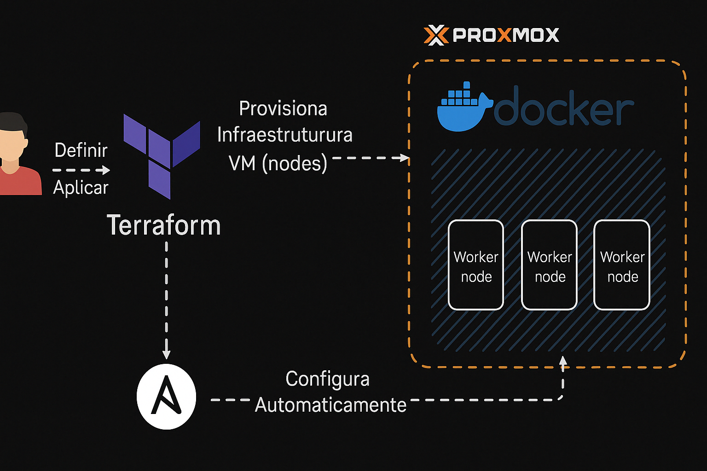

# 🐧 Projeto de Provisionamento Automático com Terraform, Ansible, Docker, Prometheus, Grafana, InfluxDB, Uptime-kuma e Speedtest



## 📌 Descrição

Este projeto automatiza a criação e configuração de um ambiente de monitoramento e serviços utilizando:

- **Terraform** para provisionamento da infraestrutura no **Proxmox VE**.
- **Ansible** para a configuração pós-provisionamento das VMs/CTs.
- **Docker** para orquestração dos containers necessários para as aplicações:
  - Portainer
  - Prometheus
  - Node Exporter
  - Alertmanager
  - cadvisor
  - Grafana
  - Speedtest Exporter
  - InfluxDB
  - UptimeKuma

---

<div align="center">
    <!-- Your badges here -->
    
    
    
    
    
    <br>
    
    
    
    
    
    
    </br>
    
</div>
<br>

## ⚙️ Estrutura

```bash
├── ansible
│   ├── inventory.ini
│   ├── provision.yml
│   └── files
│       ├── .env
│       ├── docker-compose.yml
│       ├── prometheus.yml
│       ├── alert.rules
│       ├── grafana/
│       │   └── provisioning/
│       │       ├── dashboards.yml
│       │       ├── dashboards/
│       │       │   └── speedtest.json
│       │       └── datasources/
│       │           └── prometheus.yml
│       └── alertmanager/
│           └── config.yml
├── scripts
│   └── run_ansible.sh
├── main.tf
├── variables.tf
├── terraform.tfvars
```

---

## 🛠️ Configurações no Proxmox

# Gerando API Tokens no Proxmox

Para que o Terraform se conecte ao Proxmox utilizando API Token:

1. Acesse a interface web do Proxmox (ex: `https://IP-DO-PROXMOX:8006`).
2. Vá até: `Datacenter > Permissions > API Tokens`.
3. Clique em **"Add"**:
   - User: `terraform@pve` (ou outro usuário com permissões adequadas)
   - Token ID: `tf-token` (ou outro nome amigável)
   - Marque a opção **"Privilege Separation"**.
4. Após salvar, será exibido o **"Secret"** — **copie imediatamente**, pois ele não será mostrado novamente.

Certifique-se de que o usuário possui permissões para VM, LXC e leitura em Datacenter.
Para mais segurança, o ideal é armazenar esse token usando um gerenciador de segredos ou como variável de ambiente.

# No seu `terraform.tfvars`:

```hcl
pm_api_token_id     = "terraform@pve!tf-token"
pm_api_token_secret = "SEU_TOKEN_SECRETO"
```

5. **Permissões adequadas no Proxmox:**
   - Usuário com permissão para criar e gerenciar VMs/CTs.
   - Adicionar `pve` realm ao Terraform:  
     Exemplo em `terraform.tfvars`:

```hcl
proxmox_api_url = "https://proxmox.local:8006/api2/json"
proxmox_user    = "root@pam"
proxmox_token_id = "terraform"
proxmox_token_secret = "seu_token"
```

---

## 🚀 Como usar

1. **Inicializar o Terraform:**

```bash
terraform init
```

2. **Aplicar infraestrutura:**

```bash
terraform apply
```

3. **Provisionamento com Ansible:**

Esse trecho, também está no "main.tf" em "run_ansible_playbook" do **Terraform**.

```bash
bash ./scripts/run_ansible.sh
```

---

## 📊 Monitoramento do Proxmox com InfluxDB e Grafana

### Configurar o InfluxDB no Proxmox:

1. No Proxmox, acesse `Datacenter > Metric Server`.
2. Clique em **"Add"** e escolha **"InfluxDB"**.
3. Preencha os seguintes campos:
   - **Server**: `192.168.18.152`
   - **Port**: `8086`
   - **Organization**: `MinhaOrganizacao`
   - **Token**: `TokenSecretoInflux`
   - **Bucket**: `MeuBucket`
   - **Verify Certificate**: `No`
4. Salve as configurações e o Proxmox começará a enviar as métricas automaticamente.

### Importar o Dashboard no Grafana:

1. No Grafana, acesse `Dashboards > Import`.
2. No campo "Import via grafana.com", insira o ID `17051`.
3. Clique em **"Load"**.
4. Selecione a fonte de dados configurada para o InfluxDB.
5. Clique em **"Import"** para finalizar.

Referência: [Monitoring Proxmox with InfluxDB and Grafana - Tanner Cude](https://tcude.net/monitoring-proxmox-with-influxdb-and-grafana/)


## 📊 Resultado Esperado

Sistema completo de monitoramento automatizado, com integração Proxmox + InfluxDB + Grafana:
- Dashboards em tempo real
- Métricas de uso de CPU, Memória, Rede e Disco das VMs/CTs

---

## 📷 Imagem do Projeto

A imagem de arquitetura pode ser encontrada em `./docs/imagem-arquitetura.png`

---

## 🧪 Requisitos

- Proxmox VE
- Terraform 1.6+
- Ansible 2.14+
- Docker e Docker Compose
- Acesso SSH ao Proxmox

---

## 📄 Licença

Este projeto é livre para uso e modificação.